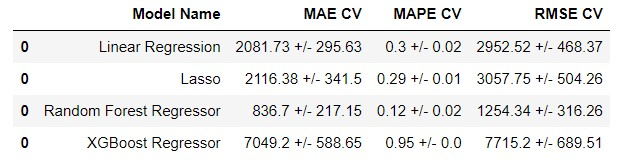

# Rossmann Prediction Sales

The objectives of this project are: 
- Sales exploratory data analysis
- Predict sales for the next 6 weeks for each store
- Access predict sales for Telegram

This project uses dataset extracted from [Kaggle](https://www.kaggle.com/c/rossmann-store-sales).
All information is fictitious.

# Contact:

# 1. Business Problem
Rossmann is a drugstore chain that operates in 7 European countries. 
The CFO needs a predict sales at 6 weeks in advance to plan store renovations. 
Store sales are influenced by local variations such as competition, promotions, school holidays, seasonality. 
According to this scenario, sales prediction are not satisfactory. a sales prediction analysis was requested using the techniques ML.

# 2. Business Assumptions
- Stores without information distance: The longest distance identified in the dataset was assumed.
- Stores without Competition Open Since: The date of sale was assumed.
- Days that stores are closed will not be considered.

# 3. Attribute List

- Id - an Id that represents a (Store, Date) duple within the test set
- Store - a unique Id for each store
- Sales - the turnover for any given day (this is what you are predicting)
- Customers - the number of customers on a given day
- Open - an indicator for whether the store was open: 0 = closed, 1 = open
- StateHoliday - indicates a state holiday. Normally all stores, with few exceptions, are closed on state holidays. Note that all schools are closed on public holidays and weekends. a = public holiday, b = Easter holiday, c = Christmas, 0 = None
- SchoolHoliday - indicates if the (Store, Date) was affected by the closure of public schools
- StoreType - differentiates between 4 different store models: a, b, c, d
- Assortment - describes an assortment level: a = basic, b = extra, c = extended
- CompetitionDistance - distance in meters to the nearest competitor store
- CompetitionOpenSince[Month/Year] - gives the approximate year and month of the time the nearest competitor was opened
- Promo - indicates whether a store is running a promo on that day
- Promo2 - Promo2 is a continuing and consecutive promotion for some stores: 0 = store is not participating, 1 = store is participating
- Promo2Since[Year/Week] - describes the year and calendar week when the store started participating in Promo2
- PromoInterval - describes the consecutive intervals Promo2 is started, naming the months the promotion is started anew. E.g. "Feb,May,Aug,Nov" means each round starts in February, May, August, November of any given year for that store

# 4. Solution Strategy
The **CRISP-DM** method was used for this project.
Below are the steps used in this project:
- 4.1. Data Description
- 4.2. Feature Engineering
- 4.3. Variable Filtering
- 4.4. Exploratory Data Analysis
- 4.5. Data Preparation
- 4.6. Feature Selection
- 4.7. Machine Learning Modeling
- 4.8. Machine Learning  - Cross Validation
- 4.9. Compare Model´s Performance
- 4.10. Hyperparameter Fine Tuning
- 4.11. Convert Model Performance to Business Values

# 5. Top 3 Data Insights
**H1.** Stores with bigger assortments should sell more. 
**FALSE:** Store with BIGGER assortments sell LESS.

**H7.** Stores open during the Christmas holiday should sell more. 
**False:** Store open during the Christmas holiday sell less.

**H10.** Stores should sell more after the 10th of each month. 
**True:** Stores sell more after 10th of each month.

# 6. Machine Learning Model
We used Machine Learning below:
- Average Model
- Linear Regression Model
- Linear Regression Regularized Model (Lasso)
- Random Forest Regressor
- XGBoost Regressor

# 6.1 Machine Learning Models Performance

# 6.2 Machine Learnig Performance after Hyperparemeter Fine Tuning

6.3 Model performance vs Business values

# 7. Business Results

# 8. Conclusion

# 9. Telegram Bot

# 10. Technologies

 
# Author:
### Francisco Moriya 

